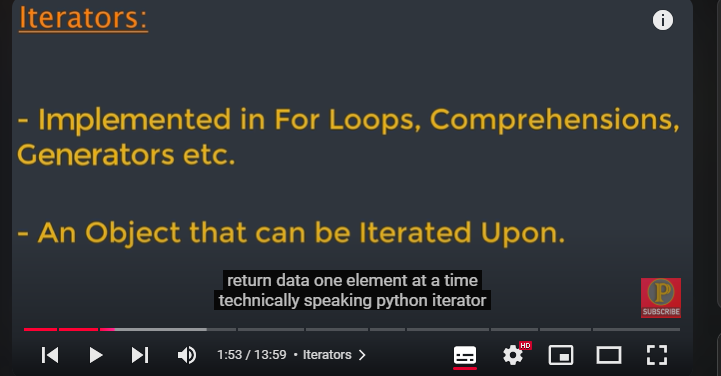
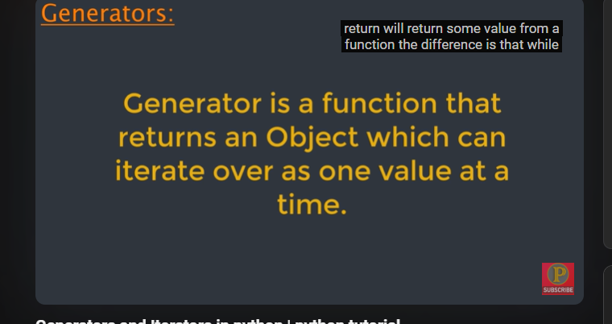
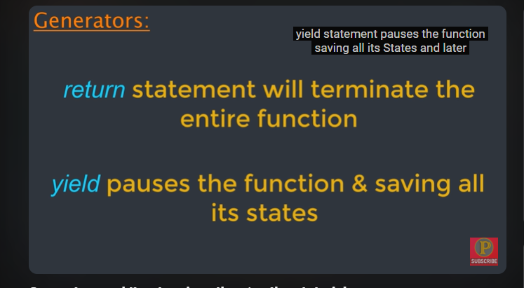
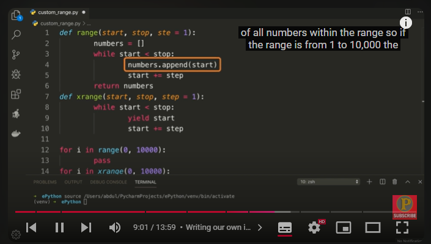
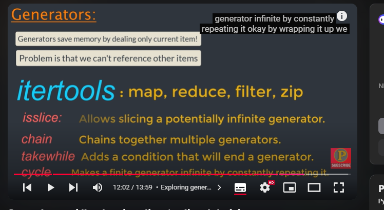
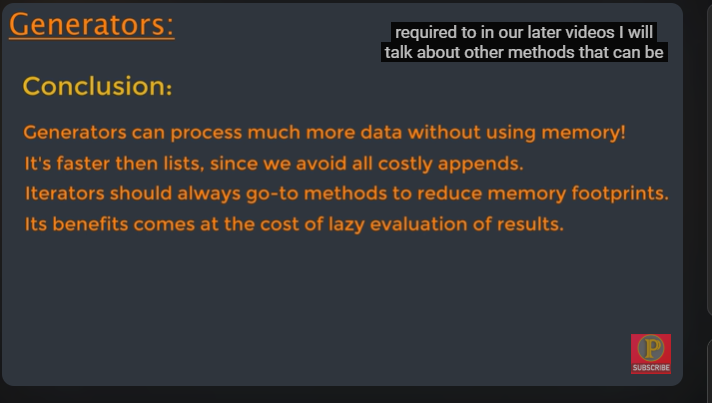

https://www.youtube.com/watch?v=Zt2P4yf8Nks&list=PLMOobVGrchXPeBgrrnQN6pimrmpTsWFiZ&index=7

__iter__ + __next__ => iterator protocol

my_list = [8, 3, 8, 6]
my_iter = iter(my_list)
print(next(my_iter))

for element in my_list:
    print(element)

use while

Generator a new way to return iterator

yied return values

