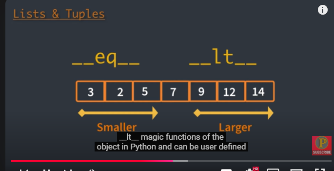
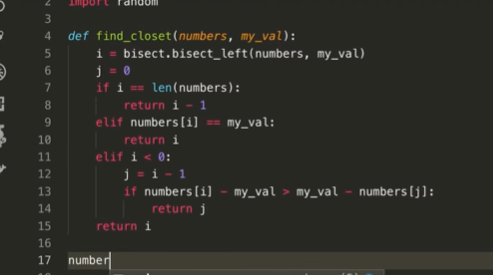
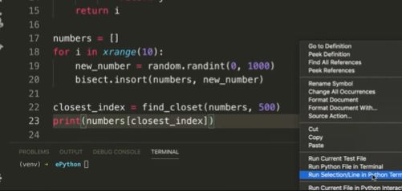
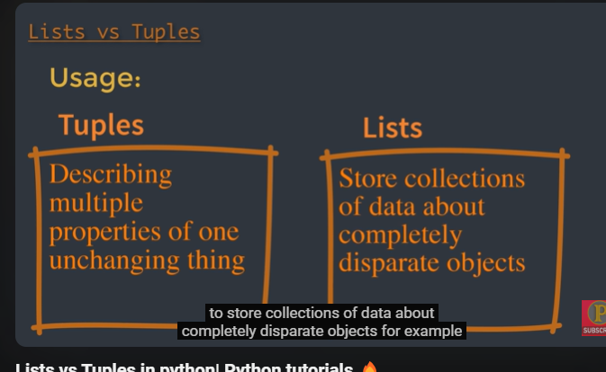
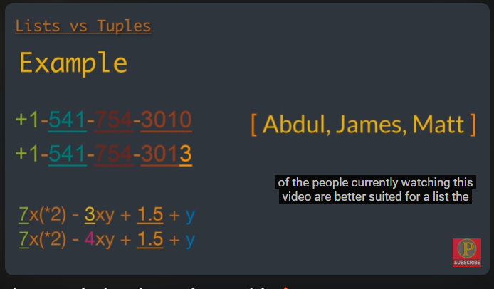
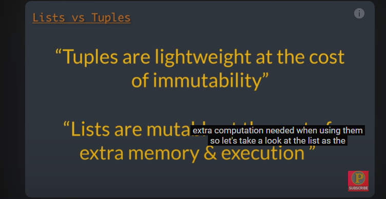
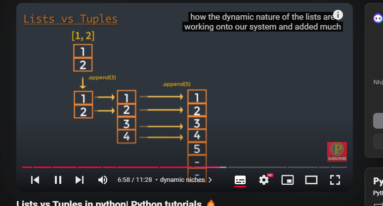

Lists are dynamic arrays
my_lists = [0, 18, 19, 93,93]

Tuples are the static arrays
t = (2, 2,3, 3)

Sort first
Smaller __eq__
Larger __lt__

tim-sort
bisect 
add el to a list
find the closet e

import bicsect
import random

def find_closet(number, my_val):
     i = bisect.bisect

Khacs

Resource Caching

List free the space it not use

Tuple not free that space but let it for future use
